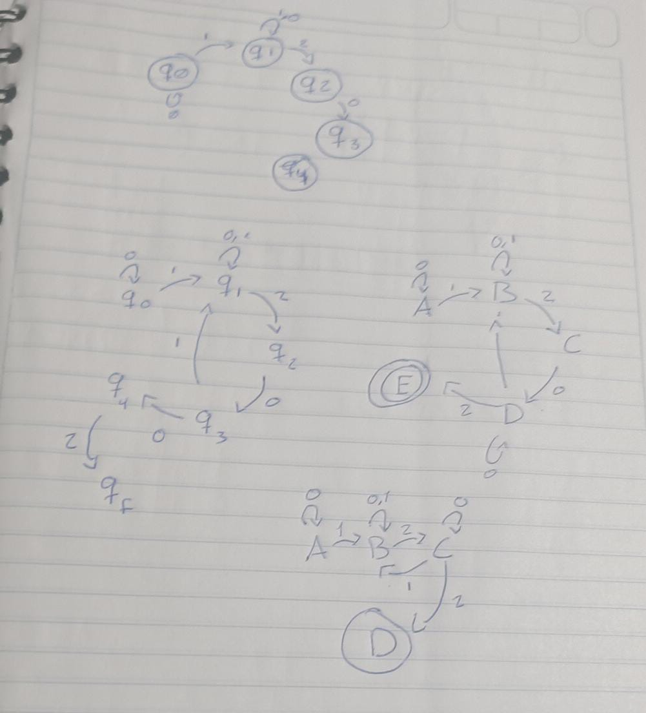

#  Implementación de Autómatas y Expresiones Regulares

## Horacio Villela Hernández  
## A01712206  
## 23/03/2025  

---

##  Descripción

Este proyecto aborda la implementación de un **autómata finito determinista (DFA)** y su correspondiente **expresión regular** para reconocer un lenguaje específico compuesto por los símbolos **0, 1 y 2**.

El lenguaje definido cumple con las siguientes reglas:

- Debe existir al menos un **1 antes de cualquier 2** en la cadena.
- La cadena **debe finalizar con la secuencia "002"** para ser aceptada.

---

##  Diseño del Autómata

En una primera versión del diseño, algunos estados carecían de transiciones de salida, lo cual generaba situaciones de bloqueo. Esto fue solucionado agregando **transiciones de bucle**, permitiendo mayor fluidez en el procesamiento de entradas válidas.

###  Bocetos Iniciales



###  Reglas del diseño final:

1. Siempre debe haber al menos un `1` **antes** de cualquier `2`.
2. La cadena debe **terminar en "002"**.
3. El autómata utiliza **tres estados**:

   - **A** (estado inicial): acepta ceros y espera el primer uno.
   - **B**: reconoce que se encontró al menos un uno.
   - **C** (estado de aceptación): se alcanza únicamente si la cadena finaliza con `002`.

###  Tabla de transiciones

| Estado Inicial | Símbolo | Estado Final |
|----------------|---------|--------------|
| A              | 0       | A            |
| A              | 1       | B            |
| B              | 0       | B            |
| B              | 1       | B            |
| B              | 2       | C            |
| C              | 0       | A            |
| C              | 1       | B            |

---

##  Expresión regular equivalente

El comportamiento del autómata fue representado también mediante la siguiente **expresión regular** en C++:

```regex
/^0*1(0|1)*(2(0|1)*(((0*1(0|1))|1(0|1)*)))*002$/gm
```

Esta expresión reconoce exactamente las cadenas válidas bajo las reglas descritas anteriormente.

---

##  Implementación en Prolog

El autómata fue codificado en **Prolog**. Se utilizaron hechos `move/3` para representar las transiciones, y un predicado `accepting_state/1` para identificar el estado de aceptación:

```prolog
% Transiciones del autómata
move(a, a, 0).
move(a, b, 1).
move(b, b, 0).
move(b, b, 1).
move(b, c, 2).
move(c, a, 0).
move(c, b, 1).

% Estado de aceptación
accepting_state(c).
```

La lógica de verificación se implementó mediante una función principal `parseDFA/1` que revisa si la entrada termina con `002`, y luego llama a un **procesador recursivo**:

```prolog
parseDFA(InputList) :-
    append(_, [0, 0, 2], InputList),
    parseDFAHelper(InputList, a).
```

### 📌 Casos evaluados

-  Caso base: lista vacía y estado actual es de aceptación.
-  Rechazo inmediato: si no hay transición válida desde el estado actual.
-  Recursión: transición válida hacia el siguiente estado.

---

## ⏱️ Complejidad

- **Temporal**: `O(n)` — se procesa cada símbolo una vez, sin retroceso.
- **Espacial**: `O(n)` — por el uso de recursión.

En el caso de la expresión regular en C++, **`regex_match()` puede alcanzar O(n²)** en el peor caso debido a retrocesos causados por estructuras anidadas.

---

##  Pruebas

Se realizaron pruebas utilizando dos implementaciones:

### En **Prolog**:  
Archivo `Automata.pl` prueba directamente la lógica del autómata paso a paso.

### En **C++**:  
Archivo `ExpresionRegular.cpp` valida cadenas usando la expresión regular con una lista de pruebas:

```cpp
vector<string> pruebas = {
  //  Casos que deben ser rechazados
  "2010202002", "12121211010102001210200000002",
  //  Casos aceptados
  "10001021201011211100021002", "1002", "1021002"
};
```

Se usaron bibliotecas estándar como:

- `<regex>` para evaluar la expresión regular.
- `<vector>` para almacenar múltiples entradas de prueba.

---

##  Comentarios añadidos a los archivos

###  `ExpresionRegular.cpp`
- Comentarios explicativos sobre el propósito de cada parte.
- Análisis de la expresión regular.
- Tiempo de ejecución estimado para la evaluación: **O(n²)** en el peor caso.

###  `Automata.pl`
- Comentarios detallando las reglas de transición y propósito de cada predicado.
- Análisis de complejidad: **O(n)** por recorrido lineal sin ciclos redundantes.
- Inclusión de condiciones de aceptación y rechazo.

---

##  Referencias

- Ullman, J. *CS154: Introduction to Automata and Complexity Theory*. Stanford. http://infolab.stanford.edu/~ullman/ialc/spr10/spr10.html  
- Tejedor, J. (2020). *Introducción a expresiones regulares*. Acceseo. https://www.acceseo.com/introduccion-a-expresiones-regulares.html


