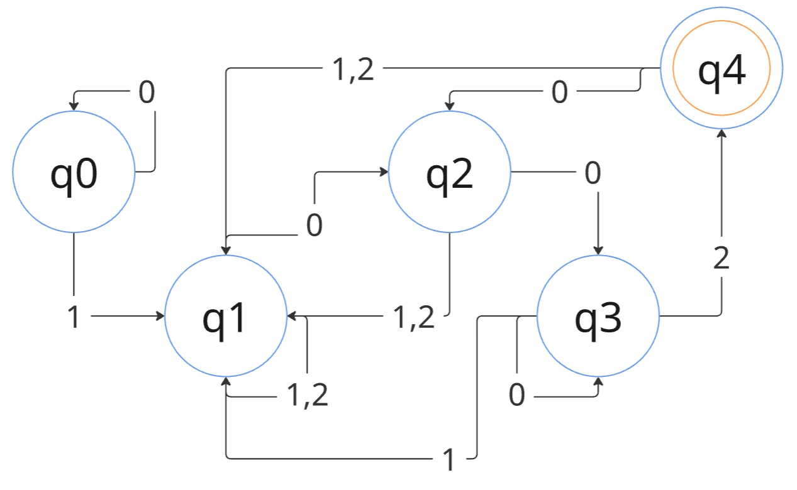

# Implementación de Autómatas y Expresiones Regulares

## Horacio Villela Hernández  
## A01712206  
## 23/03/2025  
## Actualizacion 22/04/2025
---

## Descripción

Este proyecto aborda la implementación de un **autómata finito determinista (DFA)** y su correspondiente **expresión regular** para reconocer un lenguaje específico compuesto por los símbolos **0, 1 y 2**.

El lenguaje definido cumple con las siguientes reglas:

- Debe existir al menos un **1 antes de cualquier 2** en la cadena.
- La cadena **debe finalizar con la secuencia "002"** para ser aceptada.

---

## Diseño del Autómata

Durante el desarrollo, se identificaron casos donde la cadena contenía `002` pero era rechazada por finalizar en un estado sin salida (`q4`). Esto se resolvió añadiendo **transiciones desde `q4` a otros estados**, permitiendo continuar el procesamiento de la cadena tras alcanzar esa secuencia final.

### Imagen del autómata actualizado



### Reglas del diseño final:

1. Siempre debe haber al menos un `1` **antes** de cualquier `2`.
2. La cadena debe **terminar en "002"**.
3. El autómata utiliza **cinco estados** (`q0` a `q4`) y ahora:
   - **`q4` tiene transiciones de salida**, permitiendo validar cadenas más largas tras `002`.

### Tabla de transiciones

| Estado Inicial | Símbolo | Estado Final |
|----------------|---------|--------------|
| q0             | 0       | q0           |
| q0             | 1       | q1           |
| q1             | 0       | q2           |
| q1             | 1       | q1           |
| q1             | 2       | q1           |
| q2             | 0       | q3           |
| q2             | 1       | q1           |
| q2             | 2       | q1           |
| q3             | 0       | q3           |
| q3             | 1       | q1           |
| q3             | 2       | q4           |
| q4             | 0       | q2           |
| q4             | 1       | q1           |
| q4             | 2       | q1           |

---

## Expresión regular equivalente

El comportamiento del autómata fue representado también mediante la siguiente **expresión regular** en C++:

```regex
/^0*1(0|1)*(0|1|2)*002$/gm
```

Esta expresión reconoce las cadenas válidas bajo las reglas descritas.

---

## Implementación en Prolog

El autómata fue codificado en **Prolog**. Se utilizan hechos `move/3` para representar transiciones, y un predicado `estado_aceptacion/1` para definir aceptación:

```prolog
% Transiciones (incluyendo q4)
move(q0, q0, 0).
move(q0, q1, 1).
move(q1, q2, 0).
move(q1, q1, 1).
move(q1, q1, 2).
move(q2, q3, 0).
move(q2, q1, 1).
move(q2, q1, 2).
move(q3, q3, 0).
move(q3, q1, 1).
move(q3, q4, 2).
move(q4, q1, 1).
move(q4, q2, 0).
move(q4, q1, 2).

estado_aceptacion(q4).
```

La lógica principal valida que la cadena termine en `002` antes de evaluar el camino del autómata:

```prolog
acepta_cadena(Lista) :-
    append(_, [0,0,2], Lista),
    recorrer(Lista, q0).
```

---

###  Casos evaluados

- Caso base: lista vacía y estado final aceptado (`q4`).
- Rechazo: si no hay transición válida.
- Recursión: si hay transición, continúa evaluación.

---

##  Complejidad

- **Prolog DFA**
  - Temporal: `O(n)` — recorre símbolo a símbolo.
  - Espacial: `O(n)` — debido a la recursión.

- **Regex C++**
  - Temporal: `O(n²)` en el peor caso, por retroceso.
  - Espacial: depende de la implementación del motor regex.

---

## Pruebas

### En **Prolog**  
Archivo `Automata.pl` que permite probar cadenas paso a paso con la lógica de estados. Ejemplos:

```prolog
?- acepta_cadena([1,0,0,2]).
true.

?- acepta_cadena([2,0,0,2]).
false.
```

### En **C++**  
Archivo `ExpresionRegular.cpp` con pruebas usando `regex_match`. Ejemplos:

```cpp
vector<string> pruebas = {
  "1002", "1021002", "121002", // Aceptadas
  "2010202002", "12002",       // Rechazadas
};
```

---

## Comentarios añadidos a los archivos

### `ExpresionRegular.cpp`
- Comentarios en cada sección del código
- Análisis del patrón utilizado
- Evaluación de complejidad

### `Automata.pl`
- Comentarios detallados en cada transición
- Separación clara de lógica de aceptación y evaluación
- Agregado de transiciones para `q4`

---

##  Cambios realizados

-Se rescribio gran parte del codigo y se adecuo el automata a la solucion del problema
- Se añadió **la transición de `q4` a otros estados**, resolviendo errores de aceptación para cadenas que contienen `002` pero continúan después.
- Se actualizó el **diagrama del autómata (`Automata2.0.png`)** para reflejar estos cambios.
- Se ajustó la documentación de Prolog para usar nombres más claros (`acepta_cadena/1`, `recorrer/2`, etc.).
- La expresión regular fue simplificada a `/^0*1(0|1)*(0|1|2)*002$/gm` para mejorar legibilidad y precisión.
- Se incorporó una sección de pruebas con resultados tanto aceptados como rechazados.
- Se agregaron explicaciones de complejidad para ambas implementaciones (Prolog y C++).

En caso de requerir un analisis sobre el pryecto antes de los cambios, el programa se encuentra en la carpeta .zip del repo
---

## Referencias

- Ullman, J. *CS154: Introduction to Automata and Complexity Theory*. Stanford. http://infolab.stanford.edu/~ullman/ialc/spr10/spr10.html  
- Tejedor, J. (2020). *Introducción a expresiones regulares*. Acceseo. https://www.acceseo.com/introduccion-a-expresiones-regulares.html
